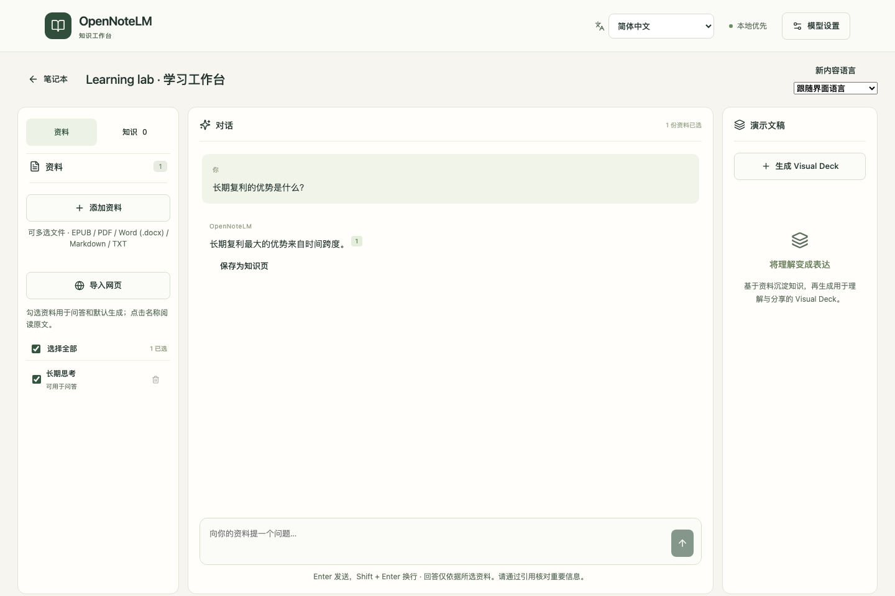

# OpenNoteLM

[English](README.md) · [使用指南](docs/USER_GUIDE.zh-CN.md) · [版本发布](https://github.com/daozen/opennotelm/releases) · [参与贡献](CONTRIBUTING.zh-CN.md)

开源、本地优先、可自托管的 AI 知识工作台：阅读资料、带出处问答、沉淀知识，
并将资料生成图文演示文稿 Visual Deck。

**资料 → 带出处的解答 → 知识页 → Visual Deck → PDF**

当前正在准备首个公开的 **0.1 Beta**。项目采用 MIT 许可，独立于 Google 和 NotebookLM。
无需注册，使用你自己的模型服务，不包含付费 API 密钥。
实际准备进度与未解决事项见[中英文发布状态](docs/RELEASE_STATUS.md)。



*截图使用自编资料和固定输出的测试模型，展示真实界面，不代表真实模型的解读或生图质量。*

## 已支持的能力

- 多选上传 EPUB、PDF、Word `.docx`、Markdown、TXT；单个或批量导入公开网页。
  可选保存网页正文图片，使用具备图片输入能力的语言模型识别扫描页和插图。
- 阅读真实目录树、连续切换章节；问答可跳转相关原文段落，知识页可保存和更新。
- 多份资料或章节合并生成一份 Deck，或者分别生成；单章自动参考已上传的全书背景。
- 根据内容和你的说明选择视觉风格，整页生成图片与文字；文字稿和出处保留在应用中。
- 停止、继续生成，查看失败详情，改名、改单页、下载 PDF，以及批量打包下载。
- 界面和新内容支持 12 种语言，包括阿拉伯语从右至左布局；首次跟随浏览器语言，
  保存的选择优先。切换语言不会翻译或改写已有资料和产物。

## Docker 快速开始

安装 Docker 和 Compose 后：

```sh
git clone https://github.com/daozen/opennotelm.git
cd opennotelm
cp .env.example .env
docker compose up -d --build
```

打开 **http://localhost:3000**，在模型设置中配置并测试：

| 模型角色 | 能力要求 | 用途 |
|---|---|---|
| 语言模型 | 兼容聊天与结构化 JSON；扫描和读图还需要图片输入 | 问答、解读、识图、Deck 文字 |
| Embedding | 向量接口与一致的向量维度 | 检索与索引重建 |
| 图片模型 | 兼容图片生成接口 | 完整图文页面 |

三个角色可使用不同服务。接口兼容不代表具备全部能力，也不保证生图中的文字准确。
模型能力测试可能产生费用。操作步骤与故障排查见[使用指南](docs/USER_GUIDE.zh-CN.md)。
容器内的 `localhost` 指容器自己；Docker Desktop 访问宿主服务可使用
`http://host.docker.internal:11434/v1` 等可达地址。不要公开密钥或包含密钥的截图。

版本化的预构建镜像会在对应版本发布后提供；发布前使用上述源码构建方式。
升级、备份、恢复和可信内网访问见[部署指南](docs/DEPLOYMENT.zh-CN.md)。

## 隐私与使用边界

- 资料和产物保存于本地 `data/`，**AI 请求会把相关内容发送到你配置的模型服务**。
  完全离线需使用本地模型。匿名统计默认关闭，没有内置项目统计接收配置。
  详见[隐私说明](docs/PRIVACY.zh-CN.md)。
- 当前为**单用户应用，没有内置登录和鉴权**，默认仅本机可访问。不要直接暴露到公网。
  详见[安全说明](SECURITY.zh-CN.md)。
- 生成图片可能出现文字错误或图表重绘误差，请对照文字稿和原文核查。默认 PDF 是
  整页图片，暂不提供可搜索正文文字层；原图用于理解，最终页面尚未精确嵌入原图。
- 旧版 `.doc`、PPTX、需登录或必须运行脚本的网页、多用户托管及模型质量保证不在当前范围。
- 备份需包含**完整数据目录和加密主密钥**。同一数据目录只能由一个服务进程使用。

## 开发与反馈

开发使用 Python 3.12、[uv](https://docs.astral.sh/uv/) 和 Node.js 24。
安装、测试与贡献规范见[CONTRIBUTING](CONTRIBUTING.zh-CN.md)，需求、架构和 agent 接手文档
见[文档入口](docs/README.md)。

通过 [Issues](https://github.com/daozen/opennotelm/issues) 反馈问题和模型兼容性，
请使用自编示例，并在分享前检查诊断报告。社区遵循[行为准则](CODE_OF_CONDUCT.zh-CN.md)。
[路线图](ROADMAP.zh-CN.md)介绍后续方向，不承诺具体交付日期。

## 许可

[MIT](LICENSE) 允许按许可条款商用、修改和分发。依赖使用各自的许可，
见[第三方声明](docs/THIRD_PARTY_NOTICES.zh-CN.md)。资料与生成产物不会自动采用 MIT。
授权边界和未来商业服务说明见[许可与商业使用](docs/LICENSING.zh-CN.md)。
