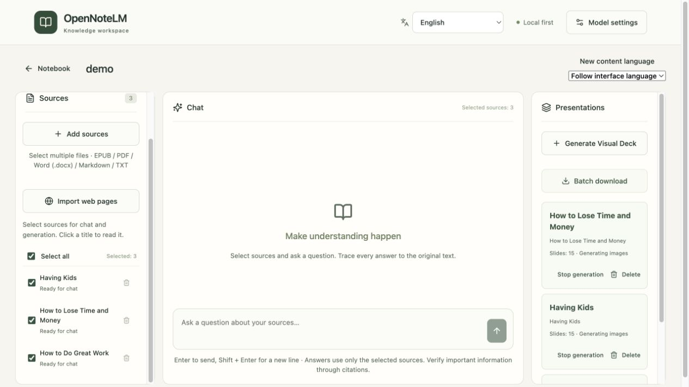
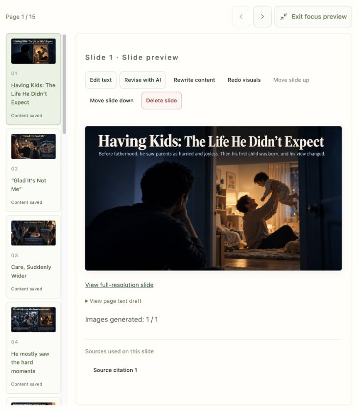
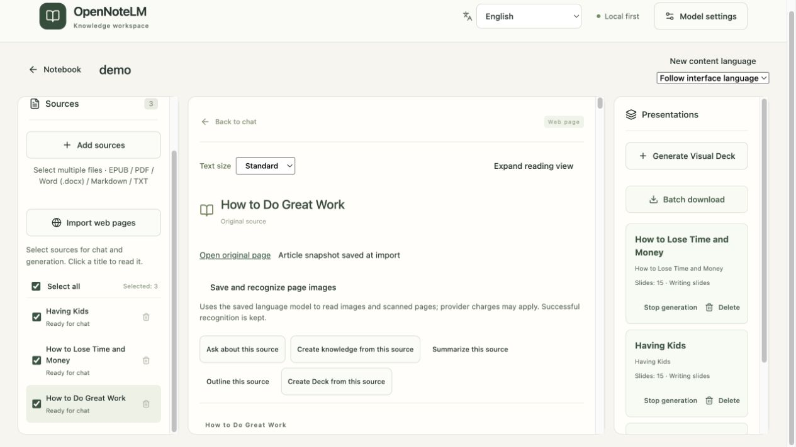

# OpenNoteLM

[English](README.md) · [使用指南](docs/USER_GUIDE.zh-CN.md) · [版本发布](https://github.com/daozen/opennotelm/releases) · [参与贡献](CONTRIBUTING.zh-CN.md)

将书籍、文档和网页变成可理解的知识，再变成可以分享的视觉故事。
OpenNoteLM 是开源、本地优先、可自托管的 AI 笔记本，提供带出处问答、知识页，
以及图文演示文稿 **Visual Deck**。

**阅读 → 带出处问答 → 沉淀知识 → 生成 Visual Deck → 导出 PDF**

采用 MIT 许可，自备语言、Embedding 和图片模型服务，无需注册。
项目独立于 Google 和 NotebookLM。



## 从资料到 Visual Deck

可以选择整份资料，也可以在目录树中勾选章节；合并生成一份 Deck，或逐资料、逐章节
分别生成。单章自动结合已上传的全书背景，让解读有完整上下文。

- **视觉表达随内容变化。** 模型根据主题和你的说明自由设计视觉方向，无固定主题目录。
  全套视觉编排协调图解、对比、时间线和场景，让页面有变化、整套又保持连贯。
- **图文作为整体生成。** 图片模型直接生成包含画面与文字的完整页面；文字稿和出处
  保存在应用中供核对。资料中的原图参与理解，相关页面写作时再次参考。
- **按你的要求解读。** 指定受众、深度、输出语言和视觉风格；可以要求浅显解释、类比
  或背景知识，同时区分来自原文的依据与引申解读。
- **修改无需全部重来。** 编辑文字、让 AI 修改单页、重做视觉、调整顺序或删页，也可
  创建重写内容或优化视觉的副本。Deck 可查看具体使用的资料、章节和知识来源。
- **掌握生成进度。** 排队或生成中可停止、继续；失败保留成功页，并提供详细失败原因。
  模型设置中可调整内容生成、图片识别和图片生成的受控并发。
- **方便分享与归档。** 自定义或沿用资料/章节名称，PDF 使用 Deck 名称；多份 PDF 可
  打包下载。PDF 体积优化保留原始页面像素与分辨率。



*截图来自本地 Demo 笔记本，界面语言为英文。生成页面仅作为效果示例，文字和图表细节
仍需对照文字稿及原文核查。*

## 覆盖完整阅读工作流

- **导入资料：** 批量上传 EPUB、PDF、Word `.docx`、Markdown、TXT，单个或批量导入
  公开网页。可选保存网页图片；具备视觉能力的语言模型可识别扫描页、插图和表格。
- **阅读与追溯：** 真实章节目录、连续章节/页码导航，问答跳转相关原文段落。
  解答可保存为知识页，继续编辑，并在需要时主动更新。
- **使用熟悉的语言：** 12 种界面和生成语言、阿拉伯语 RTL，首次匹配浏览器语言并保存
  手动选择，切换界面不改写已有内容。
- **保留自己的工作空间：** 原资料、快照、出处和产物保存在本地数据目录。切换
  Embedding 后可重建索引，无需重新解析文档，也不改变原文引用。

<details>
<summary>查看资料阅读界面</summary>



</details>

## Docker 快速开始

安装 Docker 和 Compose 后：

```sh
git clone https://github.com/daozen/opennotelm.git
cd opennotelm
cp .env.example .env
docker compose up -d --build
```

打开 **http://localhost:3000**，在模型设置中配置并测试：

| 模型角色 | 能力要求 | 用途 |
|---|---|---|
| 语言模型 | 兼容聊天与结构化 JSON；扫描和读图还需要图片输入 | 问答、解读、识图、Deck 文字 |
| Embedding | 向量接口与一致的向量维度 | 检索与索引重建 |
| 图片模型 | 兼容图片生成接口 | 完整图文页面 |

三个角色可使用不同服务。接口兼容不代表具备全部能力，也不保证生图中的文字准确。
模型能力测试可能产生费用。操作步骤与故障排查见[使用指南](docs/USER_GUIDE.zh-CN.md)。
容器内的 `localhost` 指容器自己；Docker Desktop 访问宿主服务可使用
`http://host.docker.internal:11434/v1` 等可达地址。不要公开密钥或包含密钥的截图。

预构建镜像是否可用见[版本页面](https://github.com/daozen/opennotelm/releases)，上述命令采用源码构建。
升级、备份、恢复和可信内网访问见[部署指南](docs/DEPLOYMENT.zh-CN.md)。

## 隐私与使用边界

- 资料和产物保存于本地 `data/`，**AI 请求会把相关内容发送到你配置的模型服务**。
  完全离线需使用本地模型。匿名统计默认关闭，没有内置项目统计接收配置。
  详见[隐私说明](docs/PRIVACY.zh-CN.md)。
- 当前为**单用户应用，没有内置登录和鉴权**，默认仅本机可访问。不要直接暴露到公网。
  详见[安全说明](SECURITY.zh-CN.md)。
- 生成图片可能出现文字错误或图表重绘误差，请对照文字稿和原文核查。默认 PDF 是
  整页图片，暂不提供可搜索正文文字层；原图用于理解，最终页面尚未精确嵌入原图。
- 旧版 `.doc`、PPTX、需登录或必须运行脚本的网页、多用户托管及模型质量保证不在当前范围。
- 备份需包含**完整数据目录和加密主密钥**。同一数据目录只能由一个服务进程使用。

## 开发与反馈

开发使用 Python 3.12、[uv](https://docs.astral.sh/uv/) 和 Node.js 24。
安装、测试与贡献规范见[CONTRIBUTING](CONTRIBUTING.zh-CN.md)，使用、部署、隐私和许可指南
见[文档入口](docs/README.md)。

通过 [Issues](https://github.com/daozen/opennotelm/issues) 反馈问题和模型兼容性，
请使用自编示例，并在分享前检查诊断报告。社区遵循[行为准则](CODE_OF_CONDUCT.zh-CN.md)。
[路线图](ROADMAP.zh-CN.md)介绍后续方向，不承诺具体交付日期。

## 许可

[MIT](LICENSE) 允许按许可条款商用、修改和分发。依赖使用各自的许可，
见[第三方声明](docs/THIRD_PARTY_NOTICES.zh-CN.md)。资料与生成产物不会自动采用 MIT。
授权边界和未来商业服务说明见[许可与商业使用](docs/LICENSING.zh-CN.md)。
