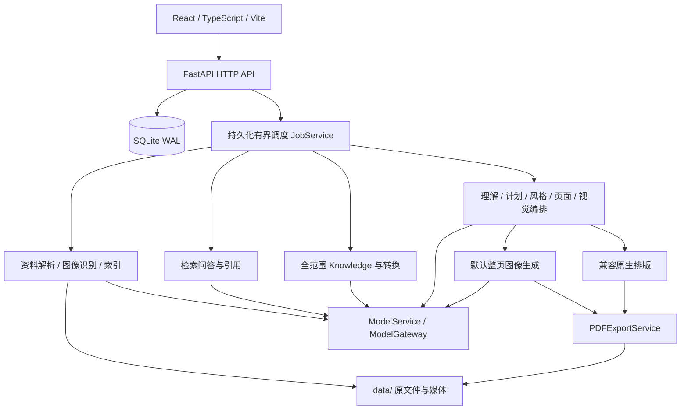

# OpenNoteLM 当前系统设计

当前产品契约见 [PRD](PRD.md)，与原始 v0.1 的差异见 [需求变更](REQUIREMENTS_CHANGES.md)。
[原设计](archive/v0.1/SYSTEM_DESIGN.md)保留用于历史对照，不能覆盖后续决策。
这里描述实际结构与约束；后续任务的入口、验证和操作步骤见 [HANDOFF](HANDOFF.md)。

## 1. 架构与职责



一个 ASGI 进程拥有一个数据目录，由 `instance_lock` 防止双实例。
`main.create_app` 在 lifespan 内执行迁移、文件恢复、服务装配、队列和遥测启动/关闭。
重任务在 SQLite 持久化，由单进程调度器受控并行出队；不引入多个server workers、
Redis/Celery/外部向量库。029取代此前单重任务规则，保留单数据目录所有者。
生产由同一后端提供 `frontend/dist` 和 `/api`；开发 Vite 代理 API 并保留 Host。

| 层 | 主要文件（均相对仓库根目录） |
|---|---|
| 服务启动与中间件 | `backend/opennotelm/main.py`, `config.py`, `instance.py` |
| 数据库/文件生命周期 | `db.py`, `migrations/*.sql`, `maintenance.py` |
| 模型与密钥 | `model_service.py`, `gateway.py`, `image_adapter.py`, `secrets.py` |
| 资料解析与识别 | `source_service.py`, `documents.py`, `epub.py`, `pdf_parser.py`, `docx_parser.py`, `text_parsers.py`, `web_fetch.py`, `web_parser.py`, `web_images.py`, `source_vision.py` |
| 阅读和证据 | `reading.py`, `passages.py`, `pdf_text.py`, `retrieval.py`, `citations.py` |
| 问答/知识 | `chat.py`, `knowledge.py`, `transformations.py`, `synthesis.py` |
| Deck 内容 | `decks.py`, `deck_schemas.py`, `deck_content.py`, `deck_context.py` |
| Deck 风格/视觉 | `deck_style.py`, `deck_art.py`, `generated_pages.py` |
| 原生兼容路径 | `page_design.py`, `composition.py`, `render_schemas.py`, `renderer.py`, `assets.py` |
| 修改和导出 | `revisions.py`, `revision_schemas.py`, `pdf_export.py`, `artifact_downloads.py` |
| 队列/并发/修复 | `jobs.py`, `concurrency.py`, `structured.py`, `output_repair.py`, `deck_validation.py` |
| 诊断/隐私 | `generation_attempts.py`, `deck_diagnostics.py`, `job_events.py`, `diagnostics.py`, `telemetry.py` |

## 2. 数据模型与事实边界

### 2.1 事实、派生内容和索引

```text
Source 原始字节 + checksum
→ SourceNode 结构
→ ContentBlock 稳定文本/图片身份 + location/page/metadata
→ Evidence 临时 ID + 原始 span
→ Citation / CitationSpan

ContentBlock → Chunk / chunk_blocks → Embedding → 检索候选
ContentBlock → 可读阅读/段落投影（不改写 ContentBlock）
```

`Document/DocumentNode/DocumentBlock/DocumentImage` 是格式无关的解析结构。
源内稳定 ID 由 `documents.stable_id` 按 source ID 与位置产生。
`source_nodes` 和 `content_blocks` 保存统一模型；图片媒体信息/识别状态保存在 metadata。
阅读重排和 EPUB 目录锚点投影不能重写旧 block 身份以修复 UI。

Chunk 仅用于检索。Embedding 向量实际存入 SQLite 的 JSON 字段，归一化后在进程内
余弦 Top-K；`data/vector/` 不代表运行中的外部向量服务或 FAISS 依赖。
Embedding 签名包含模型身份、维度及 chunker 版本；032新增身份区分服务地址，旧配置
继续兼容原模型ID/维度签名，升级不使旧索引失效。密钥轮换不改变身份；同名实际模型
变化可显式强制全部重算。向量生成期间配置变化时，发布前事务检查签名并拒绝旧结果。
显式全部重算建立新索引身份，重算失败的旧向量不能与可能已换权重的同名模型查询混用。
向量批次完成后事务性替换索引，不先删除旧索引再等待模型响应。

`IndexRebuildService`注册`source_reindex`，使用现有持久任务/资料写预约及共享请求额度；
仅调用`RetrievalService.index`，不经过source_ingest/解析/识图。模型测试成功后，在模型
配置写事务内为已关联Notebook、有已解析文字且索引过期的资料排队，按source ID去重。
连续换模型重定向唯一queued/running任务的payload目标；运行中旧结果不得发布，任务
随后继续最新目标。失败项保留旧索引，可单独重试；重启遵循原持久队列恢复契约。
GET `/api/settings/models/embedding/indexes`按当前签名返回整体及逐资料状态；POST同路径
`/rebuild`接受`missing/failed/all`。设置组件按需挂载后每2秒刷新，关闭后停止轮询，
后台任务仍继续。无需迁移；配置身份保存到Embedding capabilities，历史签名兼容见032。

### 032补充：重新关联资料的索引恢复（2026-10-04）

模型切换重建只处理关联Notebook的资料。SourceService.attach在关联事务内按当前
Embedding身份为该资料补排source_reindex；有效索引跳过、活动任务去重，其他未关联
资料不自动重算。只重建索引，不解析文件/OCR或改事实层。回归覆盖重复关联及问答可用。

`CitationSpan` 保存 `source_id/block_id/start_offset/end_offset`，历史跨度不会随
Chunk 重建变化。永久删除 Source 后仍保留历史引用身份，预览显示不可用。
不能通过弱化 ID/范围验证来提高模型成功率。

### 2.2 业务表与派生表

| 领域 | 表/内容 |
|---|---|
| Notebook 与资料 | `notebooks`, `sources`, `notebook_sources`, `source_nodes`, `content_blocks` |
| 检索 | `chunks`, `chunk_blocks`, `embeddings` |
| 问答和出处 | `conversations`, `messages`, `citations`, `citation_spans` |
| 知识与转换 | `knowledge_pages`, `transformations`, `synthesis_checkpoints` |
| Deck | `decks`, `slides`, `slide_designs`, `assets`, `slide_renders`, `pdf_exports`, `slide_revisions` |
| 批量与全书 | `deck_batches`, `work_context_cache` |
| 运行状态 | `jobs`, `processing_runs`, `generation_attempts`, `garbage_files` |
| 配置/遥测 | `model_configs`, `app_settings`, `telemetry_queue` |

完整 DDL 以迁移文件为准，而非复制一份容易漂移的字段定义。
最近迁移：014 扩展 `docx` 类型（表重建），015 批量回执，016 全书缓存，
017 每次内容生成的安全诊断，018 网页来源类型与 URL 唯一索引（表重建），
019 Deck 名称策略、稳定导出标题与来源名称快照。
新增 schema 使用后续有序迁移，不能编辑已应用的 SQL。
迁移事务回滚并执行外键检查；遇到未知较新 migration 则拒绝旧版本打开数据。

### 2.3 数据目录

```text
data/
├── app.db                  # SQLite；运行时可能有 -wal/-shm
├── instance.lock           # 留存 inode 的进程锁，不可通过删除解锁
├── sources/{source_id}/
│   ├── original.{ext}      # 原始上传字节
│   ├── media/              # 原图 PNG、逐图/重复图识别 checkpoint
│   └── visual-readings/    # 可重建的 Deck 原图理解缓存
├── assets/{asset_id}/      # 生成图像
├── renders/{render_id}/    # 页面/缩略图/原生文字与 PDF 等输出
├── exports/{export_id}/    # deck.pdf
├── secrets/master.key     # 解密主密钥，备份必需
├── secrets/{secret_ref}    # 加密 API 密钥
├── cache/                  # 上传临时文件等
└── vector/                 # 预留目录；当前向量仍在 SQLite
```

识别 transcript 是已经发布的来源识别结果，不能把它与可丢弃的 Deck 视觉摘要缓存
混为一谈。文件 API 验证目录归属/校验和，禁止依照文档 URL 下载外部图片。
删除先事务记录 `garbage_files`，再清理已提交的归属目录；启动时恢复未完成清理。

## 3. 资料链路

```text
上传/去重/NotebookSource
→ 解析文档结构、原生文字和图片位置
→ SourceVisionService：准备原图/扫描页并识别
→ persist_document：原子保存统一节点与 block
→ RetrievalService.index：分块、Embedding、发布索引
```

状态主要为 `uploaded → parsing → recognizing_images → parsed → indexed`；
无图片时略过识别；失败记录 `failed/error_code`。没有 Embedding 时可保留 parsed，
返回 `needs_embedding_model`，但 Chat 检索仍需有效索引。

PDF：pypdf 提取文本/书签，PDFium 渲染低文本/检测到的矢量页；PDFium 操作加进程锁。
DOCX/EPUB：受限 ZIP/XML/HTML 解析，提取内嵌栅格图，不执行字段/脚本/外部关系。
图片归一化预览最长 2400px、解码输入上限 40MP；识别调用语言模型多模态
Chat Completions，输出受限 schema，格式错误有界修复。
识别用固定 worker 池及重复图单飞锁，checkpoint 复用，结果按文档顺序发布。

一张图失败保留其他成功结果和原生文字，metadata 记录 `image_failures`；
不要假设 Source 数据库有 `partial` 状态。全扫描无可用正文时保持媒体可读并明确失败。
正文变化事务性失效旧 chunk/index。旧导入通过显式 recognize-images 路径补充，
不是仅重启就向模型发送新资料。

网页由 `POST /notebooks/{id}/sources/urls` 接收逐项 URL，每批最多 50，回执与抓取分离。
`source_ingest` 先 `fetching_web`，受限下载公开 HTML，持久化 `original.html/web.json` 后走统一
解析/索引。Trafilatura 正文/标题/表格转换为稳定 block；不执行脚本。
规范 URL 唯一，checksum 抓取前为 pending 身份，抓取后为 URL+NUL+HTML 摘要；另保存字节校验。
重试复用快照；成功资料不因解析器更新静默改写。所有 DNS 答案/每跳 URL 检查并固定连接 IP，
Host/TLS 原域名验证；仅代理 fake-IP 全部落入 198.18/15 时经固定 Cloudflare DoH 取真实公网 A 记录。
详细边界、可关闭开关和 notekitlm 借鉴见 [023](decisions/023-batch-files-word-fix-and-web-import.md)。

网页导入可带 `save_images`（API 缺省 false，UI 默认 true）。正文先发布，独立
`source_web_images` 排队补图；不把正文状态改为 recognizing_images。`web_images.py`
按正文范围发现的 image 候选，用安全公共下载器保存去重原始字节与 PNG 预览，单图失败
隔离。成功下载再走既有 SourceVision 并发/识别缓存、image block 和 Deck 原图理解路径。
`web_images_status` 描述图片 partial/failed，正文仍 parsed/indexed；UI 展示具体失败并可重试。
原图身份/正文/成功 transcript 冻结，checkpoint 损坏可恢复，正文快照不重新抓取。
数据与限制见 [024](decisions/024-optional-web-image-archive.md)；schema 不新增迁移。

## 4. 阅读、段落证据与路由

`reading.py` 根据原始 PDF 字形/行位置建立可重建投影，要求文本精确对齐；
`parts` 保留原 block ID，投影失败回退原 block。
`passages.py` 把检索命中扩展为 Scope 内可读段落及多 span，超长段落有界分割。
`citations.py` 返回精确 quote 及段落上下文/原图，前端 `Citations.tsx` 导航至 Reader。
图像无 transcript 时仅注册且媒体仍可用的 image block 允许零长度 span；普通文字不允许。

前端 History API 路由由 `Navigation.tsx` 实现，导航保护在 `NavigationGuard.tsx`：

```text
/
/notebooks/{notebook_id}
/notebooks/{notebook_id}/sources/{source_id}?node={node_id}&block={block_id}
/notebooks/{notebook_id}/knowledge/{page_id}
/notebooks/{notebook_id}/decks/{deck_id}?slide={slide_id}
```

可选 query：`tab=knowledge`，`scopeSource`，`scopeNode` 或重复的 `scopeNodes`。
URL 编码已保存的位置与 Scope，不含密钥或全文，不作为草稿存储。
后端对非 API 的有效前端路径提供 SPA 回退，API 错误不能回退成 HTML。
`readingNavigation.ts` 区分章节/作者标题与 PDF 页，PDF 无书签不发明目录。

DeckView预览图覆盖左右各50%的透明语义button，物理左/右在RTL界面也保持上一页/下一页。
图片点击、工具栏和↑/↓共用有界页选择，走现有`onSelectSlide`稳定ID路由；首尾不循环，
既有预览滚动重置与缩略图定位继续生效。仅Deck已加载页时注册键盘监听，卸载时移除；
编辑器/引用/确认或其他Modal开启、输入控件、IME、已处理事件和组合键均不拦截。
透明按钮保留可访问名称与键盘焦点提示；高清原图链接移到预览图下方。嵌套图片容器
使原offsetTop参照改变，图片高度预算改按相对预览容器的矩形位置加scrollTop计算。
不发新增写请求、不修改页序/生成产物，详见[025](decisions/025-deck-preview-navigation.md)。

## 5. Chat、Knowledge 与转换

Chat：冻结 Scope → Embedding 检索 → 原始段落 evidence → 语言模型 → 引用验证/一次修复
→ 保存消息和 span。最近一次用户消息帮助短 follow-up 检索，不调用 Query Rewrite。
没有证据不能用模型背景填充答案。检索 trace 仅内部保存，诊断输出不含 query。

Knowledge：完整 Scope 的 block → `SynthesisService` 分层汇总 → Markdown 与原文引用。
更新有既有正文和新 Scope，保留仍有支持的信息；操作由用户触发。
`TransformationService` 提供临时转换及主动 save。三者不继承 Deck 的自由引申规则。
从 Knowledge 创建 Deck 冻结内容、revision 与真实引用快照，不引用 Knowledge 作为 Source。

### 5.1 新内容输出语言（034）

`languages.py`定义与界面相同的12种`OutputLanguage`；ChatInput、KnowledgeInput和
TransformationInput可选`language`，旧请求/已排队payload缺失或null保留旧行为。
Workspace选择`interface | UiLanguage`，默认interface，仅保存在当前组件；提交时解析成
具体代码，所有异步任务冻结payload，模型指令只由白名单语言名构造。
新Deck继承该选择作为创建框初始值，仍可在创建框单独选择，不重写历史Deck。
DeckInput 只接受12种语言代码。Deck 理解传入 output_language；brief/plan/author
系统指令和输入显式携带语言。deck_language.py 统一说明可见文字与叙事字段的语言，
源文、旧规划和内部美术描述不可改变输出语言，修复请求仍保留同一系统指令和语言。
明确的双语/多语请求保留，不使用文字体系检测作为保存门槛，也不增加语言判别模型。
Synthesis的分层压缩和最终输出均接收语言，prompt/system哈希纳入checkpoint身份；
Chat上下文计数包含增加的语言指令，引用验证/修复和原文证据契约不变。
生成metadata记录language，保存临时转换/问答为知识页时保留。Knowledge更新使用页
metadata中的语言；显式请求改语言返回409 KNOWLEDGE_LANGUAGE_CHANGED，旧页无metadata
仍沿用原“保持页语言”提示，不猜测或迁移既有正文。未生成的默认知识页标题用title_pending
标记供UI显示本地化占位，用户自定义标题不翻译。
Chat保存的旧INSUFFICIENT控制字符串不改写：读取时仅给完全匹配的assistant消息添加
answer_status=insufficient_evidence，UI显示本地化提示；用户相同文字仍按原文呈现。
诊断日期与数值使用当前UI locale。Docker增加fonts-noto-core覆盖阿拉伯语/印地语字体，
生成图片中的文字仍取决于配置模型，没有增加自动语言检测、机器翻译服务或文字校对。

## 6. Deck 的完整链路

```text
创建并冻结 scope / Knowledge 快照
→ 解析用户内容偏好（持久化）
→ node/nodes 自动读取所属全书，或复用全书摘要
→ selected scope 理解：直接读相关原图 + 原文，分层教学 dossier
→ DeckBrief
→ DeckPlan（页数/叙事/出处/教学点/reading_budget）
→ 内容自适应风格策略与 DeckStyleManifest
→ 逐页 SlideSpec（语义内容、basis、真实引用、视觉关系）
→ 全套 art_direction（仅整页生成路径且内容齐备）
→ 每页 exact_visible_copy + 风格/表达意图 → 图片模型
→ 保存完整页面图片/缩略图
→ PDF 导出
```

`render_mode` 默认 `generated_page`，创建仅要求 Language/Image 的相应服务可配置；
默认 Setup UI 仍要求三角色测试。理解读取完整 Scope，不以 Chat Top-K 作整套 Deck 输入。
已成功阶段保存于 Deck 字段、slide rows、checkpoint、asset/render/export。
规划/风格/全局汇总/编排/导出有前后依赖，独立分段和逐页写作才受控并行。

### 6.1 意图与内容分类

`DeckPreferences`：`source_only`, `chapter_only`, `include_editorial_notes`, `dense_text`。
首次偏好解析与 dossier 均收到真实用户补充说明；单页 revision 可局部覆盖。
`deck_content.py` 控制硬约束、展示默认及禁止无请求的生硬元说明。

`basis` 用于元素、列表 item、视觉关系的内部来源分类：

| basis | 引用规则 |
|---|---|
| source | 原文事实/引文，要求的正文类型需原始出处 |
| interpretation | 对实际段落的解读，引用作为解读锚点 |
| background | 模型背景，无源内引用 |
| analogy | 说明性例子，无源内引用 |

子项可继承父项引用；background/analogy 不能携带或继承 Source 引用。
quote 必须 source。模型分类和引用校验不验证全部语义真伪。
内部分类型、element/evidence ID 不作为 `exact_visible_copy` 文字发送给生图模型。

### 6.2 全书背景

`WorkContextService` 在 `node/nodes` 场景读取完整父 Source，结合真实 TOC 祖先路径
生成全书 reading map；不同父资料分开，选中章仍是主体。
首次全书阅读可分层、多次模型请求，缓存 `work_context_cache`，兄弟章节复用。
摘要的原始 spans 和工作 evidence namespace 保留，正文不是每页完整重发。
`chapter_only` 跳过父书阅读；`source_only` 仍允许上传全书内其他章节的真实资料。
`page_context` 保留解释文本，只暴露该页允许的 evidence 标记，避免跨页凭空引用。

### 6.3 原图输入与原图未嵌入的边界

`SourceVisualService` 通过内置 source media、checksum、block/span 绑定 pixels。
Deck 与全书初读按至多四图和上下文预算分组，每张 eligible 图片首轮均有读图机会。
发送的图片最长 1600px、high detail，每图保守估算 3072 token；这是预算策略非实际计费。
页面作者至多重读四张相关图，放不下的图列为未重新附加，保留已研究的 dossier。
必要原图丢失或端点不支持 vision 明确失败，不悄悄降级为 transcript-only。

原图信息进入作者视觉方向、art direction 和最终文字提示。
最终 `images/generations` 调用仍传文字提示，不使用 image-edit 接口传原图或精确嵌入。
图片理解、文档 OCR 和最终图像生成是三个不同阶段。

### 6.4 风格与全套表达

`deck_style.py` 从真实 dossier、语义页面、用户指令产生三个自由定义的方向并选择。
`visual_strategy` 与 `style` 持久化；retry 不重新随机挑选。
媒介/配色/字体/空间语言传给 art 和 page prompt，防止后段又恢复通用纸张插画。

`deck_art.py` 保留 13 种解释形式词汇及内容先决条件，拒绝未支持的数量/引用/因果箭头。
整套编排要求 10/15/20 页至少 5/6/7 种形式、邻页不重复、单形式不超过约三分之一；
这些是表达约束，不是主题模板。平面语言不强制立体视角/明暗交替。
art 数据按稳定 slide ID/内容签名缓存，revision 只更新对应页关联。
实际图片是否符合布局或文本要求仍需要人工查看。
028修复布局归一化：NFKC/casefold后保留Unicode字母/数字/组合字符；移除明确的页码标签，
不删除中文或空间比例/列数。按规范化描述分组，超过ceil(page_count/3)时只诊断多出的
pages[i].layout字段；不按模型字句相似度声称已证明实际图片多样性。

### 6.5 页写作与修复

Planner 收到可引用目录：selected dossier 的出处及真实提供的全书背景 packet。
有 spans 的已提供背景不因未出现在章节摘要中而被错拒；未知 ID 仍拒绝。
作者仅允许自己页计划所选 IDs，并检查原始 span 可用性。

`structured.py`：解析 JSON/完整代码围栏 → Pydantic → 业务校验。
失败时把候选、字段路径、反馈作为 user DATA 发送，不能放进 system 作为指令。
规划通常请求有界字段 patch；页面作者 auto repair：少量字段用 patch，
整组内容压缩或无定位路径用完整单页 JSON，程序只合并已诊断字段。
无定位路径不能请求空 patch；`diagnose_art` 在 schema 错误时也预检所有可识别业务规则。
容器路径覆盖子路径，避免删除列表元素后使用失效下标；合并后重新完整验证。
`deck_validation.py` 尽可能同时指出结构之外的出处分类/长度/排版引用约束。

规划与 synthesis 最多两次；作者和 art 最多三次，第三次须修复暴露新问题或明显减小超长，
相同失败停在两次。copy-only 长度修复避免重新附加 pixels；语义/结构修复保留必需图。
028去重业务校验与预检的同一FieldValidationError，避免同一问题重复计数/反馈；
修复进展签名包含业务reason，区分同一字段上新暴露的问题，仍最多三次、无进展两次即停。
art_layouts安全issue按影响页展开，附重复次数/上限；仅数字和白名单路径进入诊断。
新可见文字目标通常低于计划预算；允许 8% 的统计误差但绝对上限 450，
显式 dense_text 为 900 个中文字符/拉丁词单位，不是模型 token。
不自动截断引文/改写段落来冒充模型通过。

Synthesis 标记只按确切已提供 ID 规范单/双括号及空/# Markdown 链接；不猜数字脚注。
优先有效返回 completion_tokens，否则用估算；另控 UTF-8 字节上限并拒绝 length 截断。
结构成功但内容不受支持仍需失败，不能以弱引用检查换取成功率。

### 6.6 当前与兼容渲染

| 路径 | 输出行为 |
|---|---|
| generated_page | 一张完整位图包含文字与视觉；无原生文字覆盖；PDF 每页完整图像 |
| native | 已保存 RenderSpec/资产/原生文字坐标，隔离 Chromium 安全渲染，PDF 可选文字 |

当前 `generation_version=deck-content-v5`；旧整页 `deck-content-v4` 仍支持。
旧原生版本由已有 metadata 判定。不要靠“是否有 asset_requests”推断渲染模式。
`generated_pages.prompt_version` 按 style/policy/version 选择 `whole-page-v1/v3/v4/v5/v6`；
原图 guidance 还进入内容签名。改变版本或强行失效会影响已有 retry/副本行为。
`renderer.py` 的 escaping、网络阻断、字体/边界约束仅为原生路径，不要删除它们。

默认 PDF 像素保真、带章节书签，不添加虚假的隐形文字坐标。

031由`pdf_images.py`统一处理整页单页PDF和最终PDF图片流：移除ASCII85，在原RGB/gray
样本Flate级别9与PNG过滤后Flate/Predictor15之间择小，无缩放/量化/有损编码。
保持旧导出签名，压缩版以encoding+旧签名独立保存；current/列表/批量优先ready压缩版，
下载同时兼容旧/新签名。显式重新导出才升级已有PDF，普通恢复复用原文件；优化失败保留旧文件。
PNG/原资料/Deck与render签名不变，无迁移或模型调用；边界和依赖兼容见decision031。
页面图片文字可能与文字稿不一致，目前没有自动 raster OCR 对齐验收。

## 7. 批量、修改、副本和状态

`Scope` 支持 `selected/source/node/nodes`；`DeckScope` 另支持 `knowledge`。
freeze 校验 Notebook/Source 归属与正文，父子重叠去重，源内按真实顺序读取。
`DeckBatchInput` 使用 `request_key`，一次最多 100 份。全部 scope 检查后单事务创建
Deck/jobs/回执。相同请求返回原 IDs，不同 body 使用旧 key 拒绝。
删除后的批量回执保留 tombstone，旧 key 重放报 `DECK_BATCH_DELETED`。
`title_mode=auto/source` 按每份 Deck 验证单来源 / 单章节；旧回执缺此字段等价 auto。
`source_manifest_json` 在创建事务冻结来源名、目录路径及知识页版本；GET sources 按需读取，
附当前可用性与实际全书背景标记。旧 Deck 只读还原并标记历史，详情见 decision026。
新建 source 模式的章节标题为 `source.title-number-chapter.title`；number 按完整真实目录
同级顺序从1编号，嵌套用点号（如1.2），不使用原始node ordinal、PDF页码或所选项索引。
EPUB按nav/NCX目录顺序和层级编号，优先于spine/正文顺序。创建manifest给章节增加可选
number字段并冻结；旧manifest缺字段兼容，无数据库迁移。复用Reader的EPUB锚点节点，
不重写ContentBlock/持久SourceNode。非目录节点无序号时不虚构，回退为资料名-节点名。
旧Deck、停止后继续及副本保留已保存名称；只有新建来源命名使用此规则，见decision027。
重命名使用实体锁及任务检查，设置 title_mode=custom；后续重新规划不会覆盖用户名称。
显示title与export_title分离，019复制历史title保持已有PDF签名；下载名动态来自title，
页面修订仍正常使PDF失效。重命名不修改页图/引用/PDF字节或Deck revision。

030增加通用ArtifactDownloadService及DeckDownloadAdapter，列表download_available使用
当前PDF签名/存在性/任务状态而非仅status。选择组件ArtifactBatchDownload复用UI流程。
POST先校验归属/当前版本，再在Notebook→排序实体锁内joined_thread流式打包并校验SHA256。
ZIP保留PDF字节/当前名称，Unicode大小写等价重名加序号，任一失败不发布部分包。
GET由FileResponse直接传给浏览器（支持Range/no-store），传输期间持锁，不使用pathsend。
每次1–100份/512MiB，最多两次打包，临时目录32包/1GiB已完成缓存、30分钟有效且每分钟
清理，容量不足提前回收最旧空闲包，下载中保护、关闭清空；Deck/Notebook删除清理关联包。无迁移/持久job，
缓存链接重启失效，原PDF不变；通用适配器后续扩展kind/格式/归属校验，当前只有deck。

Revision 有自身 payload/revision guard，分别内容/视觉/图片/AI 选择/文字修改；
改单页会使相应 render/export 过期，其他页文字与引用不变。重排/删页使用稳定身份。

副本不共享产物归属或原 batch membership。视觉优化 UI 请求 `restyle=true`；
内容重写默认 restyle。标准 10/15/20 页重写重新理解和规划；删到非标准页数保留既有
dossier 与页面顺序，更新作者而不复原删页。API 可显式 `restyle=false` 保留旧视觉身份。

Job 状态：`queued/running/completed/failed/cancelled`。
Deck 除 draft/阶段状态/partial/ready/failed 外支持 `paused`。
Job completed 不等于 Deck ready：部分失败可以 completed + Deck partial；
错误留在 slide，成功页保存；文字未齐前不调用 art 产生 DECK_CONTENT_REQUIRED 遮盖错误。
PDF ready 只在可用页面产物齐备且导出成功后出现。

停止先事务持久化 cancelled/paused，再取消并 join 正在进行的 task 和受保护写文件；
继续重排原 job 与 payload。用户停止任务不会随重启自动恢复；意外中断 running 可恢复。
同实体停止/继续/修改/删除串行化，防止后台写入与文件删除竞态。
取消本地请求不保证上游已接受的远程推理同时停止计费。

## 8. 缓存、并发与诊断

| 缓存 | 位置/键 | 复用与失效 |
|---|---|---|
| 识别 transcript | `sources/{id}/media/*.json` | 图身份/kind/checksum/识别版本；重复单飞；成功识别事实保持兼容 |
| synthesis checkpoint | `synthesis_checkpoints` | job、step、输入 hash；全书与章节 step 分离 |
| 全书 reading map | `work_context_cache` | source/结构/block/文字/原图 checksum/模型端点-ID-预算/prompt/version；不同章节复用 |
| 原图 compact reading | `sources/{id}/visual-readings/{hash}.json` | 图/block/checksum/模型/指令/偏好/全书上下文/版本；canonical IDs remap 到当前 job |
| 页面设计/图片/render/PDF | 业务 rows + 归属文件 | 内容/风格/指令/版本签名与实际文件校验和，成功结果复用 |

全书缓存不包含章节选择或章节特有指令；不把它当用户自由解读的共享知识。
原图阅读缓存只复用已验证 compact reading，检查 IDs/primary refs/输出大小；
原子写临时文件后 replace，损坏当 miss。不要把完整模型请求/图片 base64 存进 SQLite。

三项并发分别存于 `app_settings` 的 `image_recognition/image_generation/content_generation`。
API 严格整数 1–20，持久设置优先于环境，任务开始冻结。
`bounded_map` 固定 worker 数，结果按输入顺序，进度按完成数，取消 TaskGroup 会 join。
`joined_thread` 用于相关识图/Deck 文件准备与缓存操作；PDF/图片写入另有已有保护。
029新增task_concurrency（1–8/default3）和model_request_concurrency（1–20/default8），
同样通过app_settings持久化，模型设置中配置。不同实体可同时执行，单实体执行与原始资料
读写互斥；冻结scope与Knowledge citation来源作为读集合，source_ingest/web_images为写集合。
claim原子事务扫描候选，保留较早读写/实体预约，source/deck/interactive类别轮换选取可运行者。
cancelled但仍在join的execution继续预约；shutdown取消并join全部执行，再恢复尚未启动的
running任务为queued/resuming。主动cancelled保持停止，不随重启恢复。

RequestBudget在ModelGateway与ImagesAdapter共享，按scheme/hostname/effective-port归组，
所有模型角色/API路径共用限额，等待队列按job轮流授予；取消等待/刚获授权都释放预约。
总请求限额对后续入场动态生效，下降时等待既有请求退出，不取消已发请求；不是RPM/TPM限流。
SharedStageBudget还约束解码/附图准备/写作/渲染/网页下载，每类额度是参与运行的快照最大值，
而非各任务相加；分段理解与author共用content预算，保留任务内部固定worker上限。
全书read按source单飞并在锁内重查签名缓存；leader取消后followers可接续，follower取消不影响leader。
网页download通过有界资料量的ready队列传给识别池，末尾sentinels关闭；仅download自有deadline，
producer/consumer用TaskGroup一起取消join，保留原图checkpoint/出处/成功识别。
Embedding最多两个32项批次并发，按输入顺序收集后事务替换；失败不发布不完整索引。
PDFium页栅格化仍保留进程内锁，整套art依赖全部文字、最终PDF组装依赖全部页面，未放松。

`generation_attempts`（017）记录阶段、耗时、尝试/结果、known validation codes/paths、
附图数和 token/finish metadata。ContextVar 防止并行响应混用。
全局诊断导出最近 100 次；单 Deck endpoint 按归属最多 500 次，UI 显示 50 次。
记录已知规则、路径、数值限制/实际计数、subject 页身份、HTTP 状态与安全请求错误；
包含结构输出、synthesis 和整页生图的尝试，原生兼容未新增完整请求 trace。
保存/导出双重白名单去掉提示/正文/拒绝值/未知字段名/端点/密钥；不是原始异常日志。
旧记录不补录缺失规则。`DeckDiagnostics.tsx` 按需读取、刷新/下载，成功后保留历史入口。
时间戳缺少时区时按 SQLite UTC 解释，报告响应 no-store，无新增迁移。
`processing_runs` 和安全 job 日志仍用于阶段失败；故障定位步骤见 HANDOFF。

可选匿名统计由`TelemetryService`发送PostHog兼容`/batch/`事件，接收地址与项目token
由部署环境配置，不是用户模型密钥。`enabled`（用户选择）与`configured`（接收配置）
分别报告；PrivacySettings以PUT偏好返回为保存事实，未配置仍可勾选/关闭。
捕获只在enabled时执行，未configured不发送；本地队列最多1000条且7天过期，关闭清空。
12语言提示保存成功、未接入时本地暂存与不发送；不在成功PUT后额外GET导致保存误报。
默认无项目token、默认不参与，当前不包含接收服务或云账户。安装UUID用于匿名安装统计，
不是个人/真实用户身份；接收方的网络日志与保留策略须在未来接入时单独明确，见033。

## 9. API 契约入口

路由与 Pydantic 是实际 HTTP/字段契约；下表省略部分 CRUD，不能替代 OpenAPI/schema。

| 模块 | 路由示例（前缀 `/api`） |
|---|---|
| Notebook | `GET/POST /notebooks`, `GET/PATCH/DELETE /notebooks/{id}` |
| 资料 | `POST /notebooks/{id}/sources/upload|urls`, `GET /sources/{id}/nodes|blocks|reading`, `GET /sources/{id}/media/{image_id}` |
| 重试/识图 | `POST /sources/{id}/retry`, `POST /sources/{id}/recognize-images`, `GET /jobs/{id}` |
| 引用/问答 | `GET/POST /notebooks/{id}/chat`, `GET /citations/{id}` |
| Knowledge/转换 | `POST /notebooks/{id}/knowledge`, `PATCH /knowledge/{id}`, `POST /knowledge/{id}/update`, `POST /notebooks/{id}/transformations` |
| Deck/批量 | `POST /notebooks/{id}/decks`, `POST /notebooks/{id}/decks/batch`, `GET /decks/{id}`, `GET /decks/{id}/sources`, `GET /decks/{id}/diagnostics?download=true` |
| Deck 控制 | `PATCH /decks/{id}` 重命名；`POST /decks/{id}/stop|resume|retry|generated-copy`, `DELETE /decks/{id}` |
| 页面修改 | `POST /decks/{id}/slides/{slide}/revise|retry|without-image`, `PATCH .../text`, `PUT /decks/{id}/order`, `DELETE .../slides/{slide}` |
| PDF | `POST /decks/{id}/export`, `GET /pdf-exports/{id}/file|preview` |
| 批量下载 | `POST /notebooks/{id}/artifacts/download`, `GET /artifact-downloads/{token}/file` |
| 模型 | `POST /settings/models/test|discover|vision-test`, `GET /settings/models` |
| 并发 | `GET/PUT /settings/models/image-generation|image-recognition|content-generation` |
| 偏好/诊断 | `GET/PUT /settings/preferences`, `GET /settings/telemetry`, `GET /diagnostics` |

`generated-copy` query 为 `rewrite_content` 和可选 `restyle`，没有独立“重写副本”路径。
会写入的跨 Origin 请求被拒；TrustedHost、CSP、nosniff、设置 no-store 继续保持。
没有身份认证：Host/Origin 校验不是公网访问控制。

## 10. 模型、配置与部署

模型文本协议 `POST /chat/completions`；结构支持 json_object 或 prompt JSON + 本地严格校验。
Embedding 用 `/embeddings`；图像生成用 OpenAI Images 兼容 adapter。
`max_context_tokens` 由用户提供；unknown-compatible 模型输入预算仍采用保守估算，
不能假设模型 ID 有特定 context/vision 能力。HTTP 超时默认 300 秒，无额外云服务。

环境密钥仅保存 `env:` 引用；UI 密钥写 Fernet SecretStore，DB 只保存 secret ref。
加密密钥与原始资料必须随完整数据目录备份，不能只备份 app.db。

| 配置 | 当前默认 |
|---|---|
| `DATA_DIR` / `FRONTEND_DIR` | `data` / `frontend/dist`（按启动 cwd resolve） |
| `IMAGE_RECOGNITION_CONCURRENCY` | 4；保存设置后由数据库覆盖 |
| `CONTENT_GENERATION_CONCURRENCY` | 2；保存设置后由数据库覆盖 |
| `TASK_CONCURRENCY` | 3；1–8，保存设置后由数据库覆盖 |
| `MODEL_REQUEST_CONCURRENCY` | 8；1–20，保存设置后由数据库覆盖 |
| `IMAGE_GENERATION_CONCURRENCY` | 2；保存设置后由数据库覆盖 |
| `MAX_DOCUMENT_BYTES` / `MAX_TEXT_BYTES` | 200 MiB / 20 MiB |
| `MAX_WEB_BYTES` / `WEB_FETCH_TIMEOUT` | 10 MiB / 30 秒 |
| `WEB_FAKE_IP_DNS_FALLBACK` | 1；全部 fake-IP 答案才查询 Cloudflare DoH，0 禁用 |
| `MAX_SOURCES_PER_NOTEBOOK` / `MAX_PDF_PAGES` | 50 / 5000 |
| `MAX_EPUB_ENTRIES` / `MAX_EPUB_UNCOMPRESSED_BYTES` | 10000 / 400 MiB |
| `MAX_EPUB_ENTRY_BYTES` / `MAX_EPUB_COMPRESSION_RATIO` | 20 MiB / 1000 |
| `MIN_PDF_TEXT_CHARACTERS` | 40 |
| `RENDER_BROWSER_EXECUTABLE` | 未指定则用 Playwright 浏览器 |
| `ALLOWED_HOSTS` | 本机；代码测试默认含 testserver，Compose 不含 |
| `TELEMETRY_PROJECT_TOKEN` | 空；匿名统计也默认关闭 |

Compose 直接暴露数据、绑定地址/端口、允许 Host、密钥、三项并发和遥测变量；
其他 Settings 环境项可通过部署配置补充，不能说所有项已有 Compose 插值。
容器使用 UID 10001，init-data 负责目录权限，包含 Chromium 与 Noto CJK。
宿主模型地址在容器里应使用可达 host gateway，不能误用容器自身 localhost。

## 11. 扩展边界与已知不足

- 无账户/RBAC/安全公网共享；内网 IP 是部署时状态，不写死代码。
- 整页文字/数字/图表没有自动视觉真实性验证；schema/citation 校验只覆盖结构与身份。
- 原图只供理解，未精确嵌入；默认图像 PDF 无搜索/复制层，原生路径仍兼容。
- PDF 书签按页范围；Word 不还原脚注/修订/Office 图表等全部语义。
- 全书摘要存在压缩损失；首次读书和大量图片仍有模型调用成本。
- 非标准长度内容副本为避免恢复删页，不重新完整规划；优化范围明确受限。
- 页写作失败后的批量 retry 已覆盖“9 页有文字但尚无图片”的情况；
  若改进单页 retry，应另测其他已写作未生图页如何最终导出，不假定与批量完全等价。
- 最新可靠性修复经过后端/前端/定向浏览器与真实模型验收；
  历史 Docker 成功不能代替这个 HEAD 的完整容器发布复验。

测试与真实性证据索引见 [实施与验收](IMPLEMENTATION_PLAN.md)；
所有变更需保护现有数据、旧版本提示与文件签名，并更新对应当前文档和决策。
开发时默认使用匹配 Playwright 的配套浏览器；macOS 真实浏览器测试先检查执行环境，
端口受限时在启动浏览器前明确失败，普通单测与真实渲染分别验证，不静默跳过。
合成页面启动/截图/PDF 检查及历史启动崩溃排查见
[HANDOFF](HANDOFF.md#macos-浏览器启动检查2026-10-04)；此检查不改变生产渲染或用户资料。

## UI 审查及语言扩展（decision 022）

035补充首次语言：languages.ts通过Intl.Locale规范化有序浏览器BCP47标签，匹配
现有目录；服务器不根据自己的OS或Accept-Language写默认。GET preferences缺少已存
语言时返回null；TelemetryService部分更新不持久化隐式zh-CN，GET/PUT响应仍包含
ui_language（可能null）。旧已存值全部保留，PUT仍仅接受12个显式代码、不接受null。
LanguagePreferencesProvider应用已存语言；无值则应用浏览器匹配并清除旧cache，不自动
PUT。首次脚本初始化也按浏览器匹配，避免先显示固定中文；缓存的已存选择只用于加载
期间，服务器读取结果是权威。无SQL迁移或已存产物改变，测试默认locale显式设置。

`languages.ts`是12种界面语言代码与原生名称目录；`i18n.ts`注册完整本地JSON资源并维护文档lang/dir。PreferencesInput允许同一组代码，沿用现有偏好存储，无迁移。`Modal.tsx`统一模态行为，以窗口栈和引用计数恢复嵌套背景/滚动状态。Workspace小屏幕面板通过CSS显隐保持挂载，不引入新的服务端对象或草稿存储。列表读取错误与操作错误分离；独立列表请求并行，既有选择/Deck刷新版本保护保留。Chat仅跟随当前消息容器滚动，用户向上阅读时暂停跟随。

## Release distribution (036)

MIT自有代码保留远程原版权声明，贡献采用DCO、不转让版权。公开快照不携带私有开发
历史；原分支完整保留。release_check检查公开文件/文档链接/许可与版本/锁定依赖清单，
secret扫描只遍历Git可见文件及历史，排除生产data与私有报告。CI只读、Actions固定SHA。
手动release任务依赖完整checks与发布环境批准，验证准确应用提交和不可移动标签；
使用原生amd64/arm64机器分别构建，保留SBOM/来源证明，逐架构扫描与空白启动核验
后按digest合并镜像，拒绝覆盖不同的已有镜像版本，创建中英文草稿预发布。源码/许可/原样MPL依赖源码附件含哈希与manifest。
Compose支持OPENNOTELM_IMAGE固定镜像，缺省仍本地build；隔离验收强制本地镜像。
Docker保留前端/Python/native/fonts许可，运行仍一个非root进程，不改用户数据、产物
或模型契约。cryptography升级50.0.2仅安全依赖更新，Fernet/主密钥格式不变。

037补充底层XML核查：Docker独立stage从锁定lxml源码及SHA-256固定的libxml2 2.15.4/
libxslt 1.1.45静态构建wheel，最终uv sync后安装。构建和镜像扫描分别核对实际编译/
加载版本，native manifest/完整许可留在镜像，并随发布附件提供上游源码与许可。
原生uv sync和现有生产环境不会因此被修改。Compose应用cap_drop ALL、禁止新增权限，
初始化仅保留CHOWN；数据目录/实例所有者/主密钥/已存产物契约不变。系统库扫描仍完整
保留并阻止未解决的高危/严重项，不以应用包版本推断系统库安全；详见
[安全核查](CONTAINER_SECURITY_REVIEW.md)。
038将云端后端、前端及容器检查分为独立任务，统一发布checks仍要求全部通过。
Docker固定两个经哈希验证的Debian厂商补丁（Expat2.8.5-2、ACL2.4.0-1），无运行期
不稳定软件源；库文件和实际版本再次核验。Linux兼容渲染固定CPU绘制，移除不用的
mount/umount/nsenter/infocmp。扫描保持原始JSON/SBOM，独立review记录已修复/当前
配置不受影响/未解决项；后者仍失败。运行探针核对全部运行代码及锁文件哈希、准确
包版本、策略摘要、权限、组件缺失和真实浏览器进程映射；2026-11-04到期。变更上述
内容须重新审查，不能仅刷新哈希来放行。无资料迁移、现有产物重写或原生环境升级。
